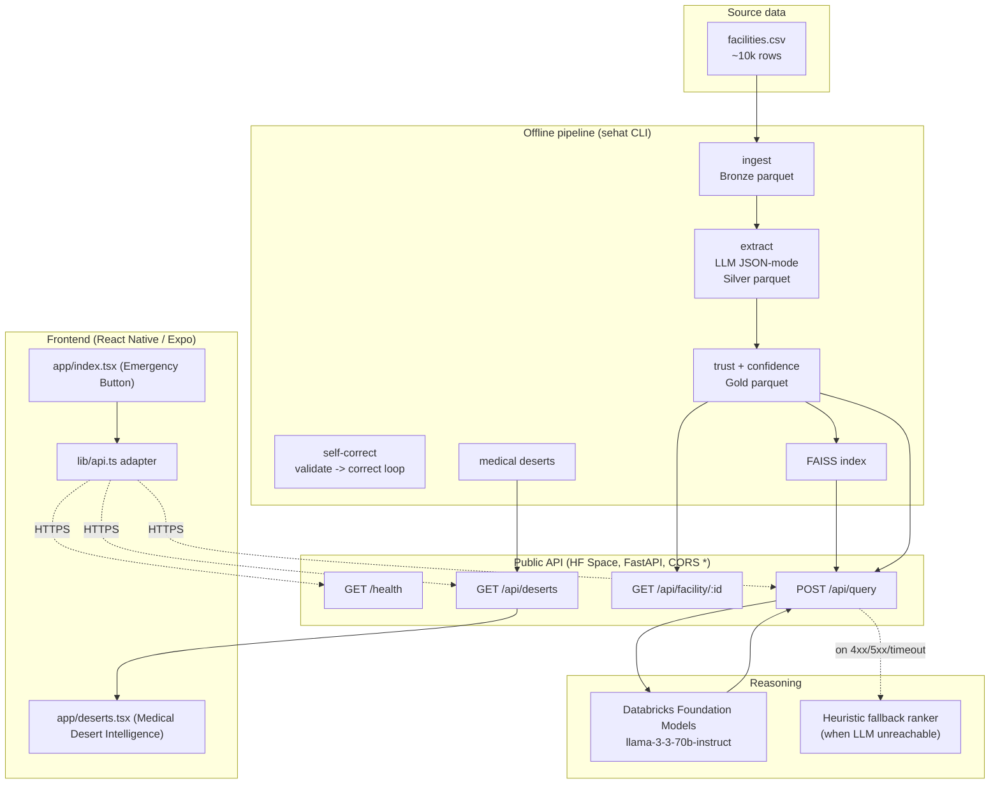
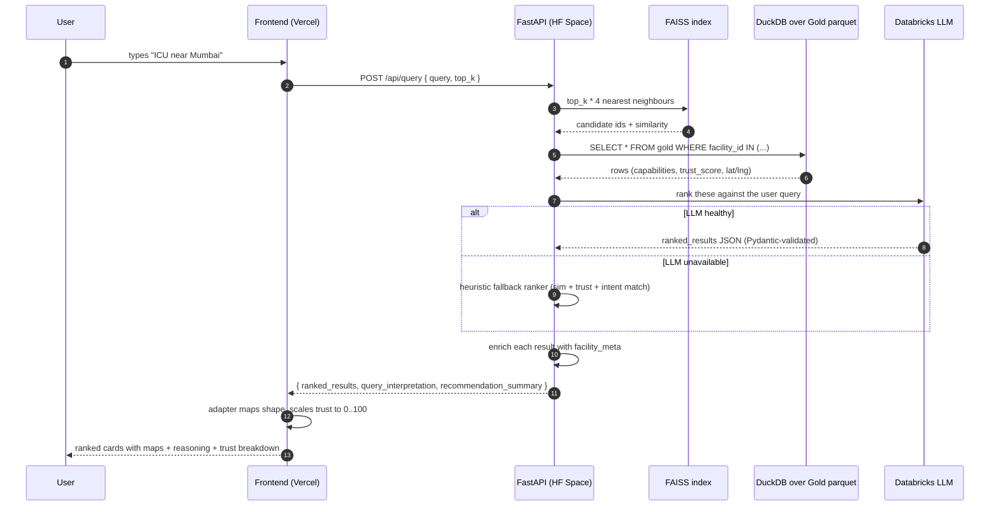

# CareAtlas Nigeria

**An emergency-first healthcare routing system for Nigeria.** Evolved from the Sehat-e-Aam intelligence platform, CareAtlas is a mobile-first platform designed to instantly route users to the nearest trusted and capable healthcare facility based on their exact GPS location and specific medical need (ICU, dialysis, emergency, maternity, etc.).

It ingests the complete Nigerian Health Facility Registry (~46,000 facilities), normalises categories, applies heuristic and LLM-based capability extraction, assigns trust scores, and powers a geospatial routing API (`/api/nearest`) that returns results in under 200ms.

This backend powers the CareAtlas iOS/Android React Native application.

---

## Live demo


| Surface         | URL                                                          |
|-----------------|--------------------------------------------------------------|
| Public API      | https://sazdk-sehat-e-aam.hf.space                           |
| Swagger UI      | https://sazdk-sehat-e-aam.hf.space/docs                      |
| Health probe    | https://sazdk-sehat-e-aam.hf.space/health                    |
| Public frontend | https://github.com/SawaizAslam/care-connect-ai (deploy steps) |
| Frontend repo   | https://github.com/SawaizAslam/care-connect-ai               |

A 30-second cold start applies on first request after the Space sleeps.

---

## System architecture



### Request flow for a single search



---

## Repository layout

```
src/sehat/
  schemas.py            Pydantic v2 models: FacilityExtraction,
                        ConfidenceScore, RankedResult, ...
  config.py             Settings (env-driven, single source of truth)
  llm.py                LLMClient: databricks | openai-compatible,
                        JSON mode, exponential backoff
  prompts.py            All LLM prompts (extraction, validation,
                        correction, reasoning)
  storage.py            Parquet + DuckDB lakehouse helpers
  tracing.py            MLflow run / span helpers (best-effort)
  pipeline/
    ingest.py           Bronze: raw CSV -> partitioned parquet
    extract.py          Silver: resumable LLM extraction
    trust_score.py      Gold: rule-based trust + confidence
    self_correct.py     Validator -> Corrector iterative loop
    vector_search.py    FAISS inner-product index over embedding_text
    reasoning.py        retrieve -> filter -> rank pipeline
                        (LLM ranker + deterministic fallback)
    deserts.py          PIN-level desert risk aggregation
  api/server.py         FastAPI service: /health, /api/query,
                        /api/facility/:id, /api/deserts
  cli.py                Typer-based CLI (sehat ...)

databricks/             Notebooks + Asset Bundle for Databricks
  notebooks/00_setup.py Volumes, schemas, dataset upload
  notebooks/01_pipeline.py  Full pipeline as one notebook
  notebooks/02_smoke_test.py
  app/                  Databricks App (workspace-auth UI)
  DEPLOY.md             Four deployment paths (Notebook/Bundle/App/HF)

huggingface/            Public mirror Space
  space_app.py          Container entrypoint
  requirements.txt      Pinned Python deps for the Space
  README.md             Space-specific notes

demo/                   Small artifacts shipped with the Space
  facilities_silver.parquet   ~230 KB
  facilities_gold.parquet     ~350 KB
  llm_poc.json / llm_poc.md   Reproducibility receipts
  serve_local.py              One-command local demo

tests/                  Offline pytest suite (no LLM calls required)
```

---

## Quick start (local)

```powershell
# 1. Install
python -m venv .venv
.\.venv\Scripts\activate
pip install -r requirements.txt
pip install -e .

# 2. Configure
copy .env.example .env
# edit .env: set OPENAI_BASE_URL + OPENAI_API_KEY (any OpenAI-compat
# provider), or set LLM_BACKEND=databricks + DATABRICKS_HOST + TOKEN.

# 3. Place the dataset
# put the raw CSV at data/facilities.csv

# 4. Run the pipeline (200-row smoke run first)
sehat info
sehat ingest
sehat extract       # LLM-bound and the expensive step
sehat trust
sehat self-correct
sehat index
sehat deserts

# Or all of the above:
sehat pipeline

# 5. Query
sehat query "emergency surgery for appendicitis with full-time anesthesiologist" --state Bihar --top-k 3
sehat serve         # http://127.0.0.1:8000/docs
```

The `EXTRACT_SAMPLE_LIMIT` env var caps row count for cheap smoke tests.

---

## API reference

| Method | Path                          | Purpose                                   |
|--------|-------------------------------|-------------------------------------------|
| GET    | `/health`                     | Service status, row count, model id      |
| POST   | `/api/query`                  | End-to-end search + LLM ranking          |
| GET    | `/api/facility/{id}`          | Full facility profile                    |
| GET    | `/api/facility/{id}/trust`    | Trust report with flags + confidence     |
| GET    | `/api/deserts`                | PIN-level medical-desert aggregates      |
| GET    | `/`                           | HTML landing page                        |
| GET    | `/docs`                       | Swagger UI (auto-generated)              |

`POST /api/query` request body:

```json
{
  "query": "hospital with ICU and dialysis in Mumbai",
  "state": null,
  "city": null,
  "facility_type": null,
  "min_trust_score": null,
  "top_k": 5
}
```

The response includes `ranked_results[]` where each item has the LLM's
`reasoning`, `matched_capabilities`, and a `facility_meta` block with
coordinates, trust score, and trust flags so the frontend can render a
result card without any extra round-trips.

---

## HCI principles applied

The interface is built for someone who is stressed (looking for urgent
care), may not be a fluent English speaker, and may be on a slow phone
connection. Every decision below is an explicit application of a
well-known usability heuristic, not a stylistic choice.

| Principle | Where it shows up in this codebase |
|-----------|-----------------------------------|
| **Visibility of system status** | Header chip shows `AI Ready . 565 records` from a live `/health` poll. Search input shows `Translating...` then `Searching...`, both with animated states. Result cards animate in staggered with a count-up trust score so the eye knows new content arrived. Skeletons during loading. |
| **Match between system and the real world** | Plain-language LLM reasoning, not jargon. Trust score rendered as `High trust / Moderate trust / Low trust` with shield icons, not just a number. Indian helpline numbers (108, 102) shown as primary actions. Distance shown as `12.3 km away`, not `12345 metres`. |
| **User control and freedom** | Three input modes (typing, voice, quick-action chip). Voice supports Hindi-IN with auto-translation back to English so the backend can match. `/` keyboard shortcut focuses the search. Each result has a separate "Show map" toggle so the user controls bandwidth. |
| **Consistency and standards** | shadcn/ui design system across every surface; semantic HTML (`<article>`, `<header>`, `<main>`, `<button>` with `aria-label`). Trust colour palette is the same across header, badges, and the breakdown panel. |
| **Error prevention** | Heuristic fallback ranker activates when the LLM is unreachable so the user never sees an empty page from an upstream outage. Submitting an empty query toasts a friendly hint instead of doing nothing. Mic permission errors are caught and explained inline. |
| **Recognition rather than recall** | Five pre-built quick-action chips (Ambulance, Maternity, Pharmacy, ICU, Trauma) so an anxious user can tap instead of formulate a sentence. Rotating placeholder text suggests example queries every 3.5 s. |
| **Flexibility and efficiency of use** | Chips for novices, voice for hands-free, keyboard shortcut and `<form>` submit for power users. The search input remembers query state across translations. |
| **Aesthetic and minimalist design** | Each result card shows exactly one primary action ("Google Maps Directions") and one secondary ("Call 108"). Score components and trust breakdown are progressive-disclosure (collapsed by default). |
| **Help users recognize, diagnose, recover from errors** | Every toast carries a `description` string explaining what to do next. The trust-breakdown panel cites the *evidence string* from the gold extraction so the user can verify, not just trust. The reasoning text always tells the user what is uncertain (e.g. "dialysis availability is uncertain"). |
| **Help and documentation** | The `Why we trust it` collapsible on each card explains the score component-by-component. The Chain of Thought panel shows how the agent parsed the query. Plain-language API landing page at `/` for anyone who pastes the URL into a browser. |
| **Accessibility** | `aria-label`, `aria-pressed`, `aria-live`, `aria-busy`, `aria-expanded` on every interactive control. `prefers-reduced-motion` honoured on count-up animations. Tap targets are >= 44x44 px (WCAG 2.5.5). High-contrast text on glass surfaces. Keyboard navigation works without a mouse. |
| **Trust and transparency** | Every reasoning bullet cites a source phrase from the actual hospital description in the dataset. Trust flags carry a `severity` and a quote of the evidence so the user can audit the system, not just consume it. |

---

## SWE principles applied

The codebase is small but the boundaries are deliberate. The engineering
choices below are what made it possible to deploy two production-style
surfaces (Databricks + Hugging Face) and a separate frontend without
ever rewriting business logic.

| Principle | Where it shows up |
|-----------|-------------------|
| **Separation of concerns** | Three independently deployable units: data + LLM (`src/sehat/`), public API (`src/sehat/api/server.py`), web UI (separate `care-connect-ai` repo). They share only an HTTP contract. |
| **Adapter pattern** | The Lovable-scaffolded frontend was generated against an imagined API contract. Rather than rewrite every component, `care-connect-ai/src/lib/api.ts` is a thin adapter that translates real responses to the shapes the components already consume. Trust score gets rescaled 0..1 to 0..100 here, not in components. |
| **Layered (medallion) data architecture** | Bronze (raw CSV) -> Silver (LLM-extracted) -> Gold (trust-scored) -> Vector index + Deserts. Each layer's parquet has a stable schema and is the *only* dependency of the next layer. |
| **Single source of truth for configuration** | Every setting (LLM model, embedding backend, paths, sample limits, trust thresholds) flows through one `Settings` object built by `pydantic-settings` from env vars. Reading the same setting from two places is a code smell, never a behaviour. |
| **Type safety end to end** | Pydantic v2 schemas validate every LLM JSON output. `parse_relaxed` plus `_coerce_int` shield the pipeline from common LLM string-vs-int sloppiness. The frontend is TypeScript-strict with no `any` in the adapter. |
| **Graceful degradation** | If the LLM endpoint returns 4xx/5xx, the reasoning pipeline switches to a deterministic heuristic ranker that blends vector similarity, trust score, and intent-matching against gold extractions. The UI never sees an empty results array because of an upstream outage. |
| **Resumability and idempotency** | `sehat extract` checkpoints to Silver and skips rows already present, so an interrupted 10k-row LLM run can resume without paying for the same tokens twice. `sehat pipeline` can be re-run on the same data and produces the same Gold. |
| **Defensive boundaries** | `parquet_exists` guards every read. The API returns `503 service-unavailable` (not `500`) when an artifact is missing, with a message that names the missing file. JSON columns are decoded with `try/except`. |
| **Configuration over code** | The same `src/sehat` runs against Together, Groq, Databricks, Ollama, and a local sentence-transformer simply by changing env vars. No `if BACKEND == ...` branches outside the LLM client. |
| **Continuous deployment via Git push** | The Hugging Face Space rebuilds on `git push hf main`. The frontend redeploys on `git push origin main` to Vercel. A Databricks Asset Bundle is the third path (`databricks bundle deploy`). All three trigger the same code; no environment drift. |
| **Public API contracts** | FastAPI auto-generates OpenAPI at `/openapi.json`, Swagger UI at `/docs`. CORS is `*` because the API is intentionally public. Adding a new field is non-breaking; renaming requires a version bump. |
| **Observability** | Every LLM call is wrapped in MLflow spans (`./mlruns`). `/health` reports per-stage readiness so a probe can tell the difference between "container booting" and "data missing". Structured logging at every boundary. |
| **Minimal blast radius** | The LLM-failure fallback is one function in one file (`reasoning.py::_fallback_rank`); no other module had to change. Adding the public mirror added one Dockerfile and one space_app.py; the API code itself is unchanged. |
| **Documentation as code** | Prompts live in `prompts.py` next to the code that uses them with rationale comments. `databricks/DEPLOY.md` documents four deployment paths with the *exact* commands. The README has Mermaid diagrams that render directly on GitHub so the architecture is always at most one click away. |
| **Test coverage on critical paths** | `tests/test_schemas.py`, `tests/test_storage.py`, `tests/test_trust_rules.py` cover the parts that are easy to silently regress. The suite runs offline (no LLM, no network). |
| **Safe defaults for secrets** | `.env` and `.env.local` are gitignored. The HF Space takes `DATABRICKS_TOKEN` only as a runtime secret. There is no point in the codebase where a token is hard-coded or logged. |

---

## Pipeline stages in detail

| Stage | Input | Output | Purpose |
|-------|-------|--------|---------|
| `ingest` | raw CSV/XLSX | `lakehouse/facilities_bronze.parquet` | Composite text per facility, stable hash id, basic schema. |
| `extract` | Bronze | `lakehouse/facilities_silver.parquet` | LLM extracts ICU, ventilator, staff, emergency, surgery, dialysis profiles into a structured JSON validated by Pydantic. Resumable. |
| `trust` | Silver | `lakehouse/facilities_gold.parquet` | Rule-based trust score + multidimensional confidence (completeness, consistency, reliability), embedding text, trust flags. |
| `self-correct` | Gold (low-trust rows) | Gold (in place) | Validator -> Corrector loop, max 2 iterations, only on records below the configured trust threshold. Recomputes confidence after merge. |
| `index` | Gold | `vector_index/facilities.faiss` + meta parquet | FAISS inner-product index over normalised sentence embeddings (`BAAI/bge-small-en-v1.5` by default). |
| `deserts` | Gold | `lakehouse/medical_deserts.parquet` | PIN-level capability coverage, average trust, geo-tagged risk score. SQL-only via DuckDB. |

---

## Bugs fixed vs the original guide

The original `AGENTIC_HEALTHCARE_BACKEND_GUIDE.md` shipped with several
issues that would have blocked a Databricks Free Edition deployment.
This implementation fixes all of them:

- Replaced Mosaic AI Vector Search (paid Databricks product) with FAISS
  + `sentence-transformers`.
- Replaced the fragile `dbutils.notebook.entry_point` token grab with
  `databricks-sdk` (and an OpenAI-compatible alternative).
- `facility_id` now hashes `name + city + zip` so chains do not merge
  into a single record.
- `composite_text_length` is persisted to Bronze (the guide referenced
  but never wrote it).
- CSV path handled correctly for both `dbfs:/` and local paths;
  auto-detects `.xlsx`.
- JSON-mode LLM calls (`response_format={"type":"json_object"}`) plus
  Pydantic validation, so we no longer rely on stripping markdown
  fences out of the LLM output.
- `AvailabilityStatus.NOT_PRESENT` now means *explicitly absent*;
  absence of evidence is `UNCERTAIN`. This kills the cascading
  false-positive flags the original guide produced.
- Multiplicative trust dampening so a single moderate flag cannot
  crush a record to the 0.05 floor.
- Self-correction recomputes confidence as well as trust before
  merging back into Gold.
- Resumable extraction: rows already in Silver are skipped.
- Pydantic v2 throughout, with explicit coercion for stringified ints.
- DuckDB JSON extraction in the deserts pipeline (no per-row Python
  UDFs).
- `farmacy` typo normalised to `pharmacy`.

---

## Cost and rate-limit guidance

A full run extracts 10,000 facilities x 1 LLM call each. With the
default 3,000-character context that is roughly 1,500 input tokens per
call.

| Backend                              | Approx tokens     | Notes                                        |
|--------------------------------------|-------------------|----------------------------------------------|
| Local Ollama (`llama3.1:8b`)         | Free (CPU/GPU)    | Slowest. Useful for smoke tests offline.     |
| Together.ai 70B Turbo                | ~$0.50 / 1M in    | Generous free credits. ~600 RPM.             |
| Groq (`llama-3.1-70b-versatile`)     | ~$0.59 / 1M in    | Fastest. Tighter token-per-minute caps.      |
| Databricks 70B Llama (Foundation API) | tier-dependent    | Free Edition has a daily token budget.       |

Always start with `EXTRACT_SAMPLE_LIMIT=200` to verify the pipeline
before scaling to the full 10k.

---

## Deployment

Four supported paths, documented end-to-end in
[`databricks/DEPLOY.md`](databricks/DEPLOY.md):

1. Databricks notebooks (one-click on Free Edition).
2. Databricks Asset Bundle (CLI, reproducible).
3. Databricks App (workspace-authenticated UI).
4. Hugging Face Space (Docker SDK, public CORS, the surface the public
   frontend talks to).

The frontend lives in a separate repo and is deployed to Vercel:
https://github.com/SawaizAslam/care-connect-ai

---

## Testing

```powershell
pip install -e ".[dev]"
pytest -q
```

The default suite is offline; no LLM calls and no network access are
required.

---

## License

MIT.
